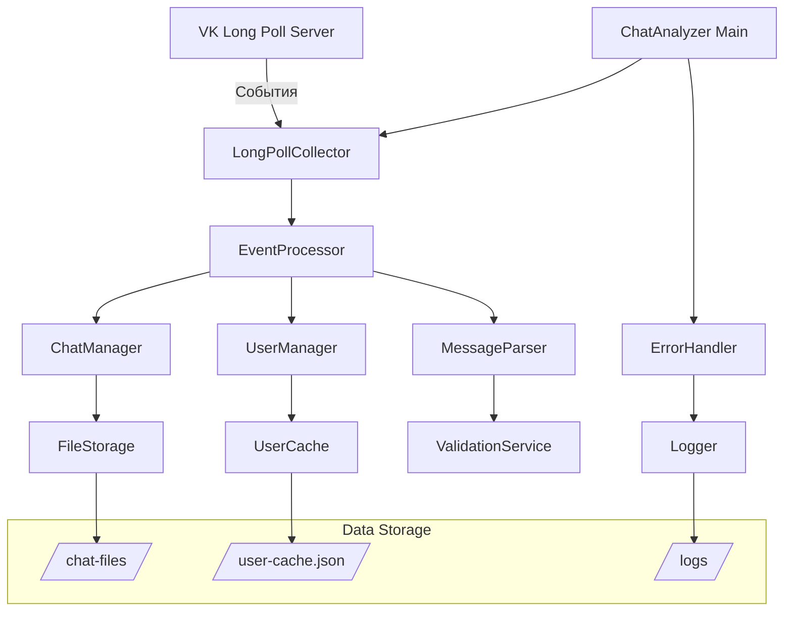
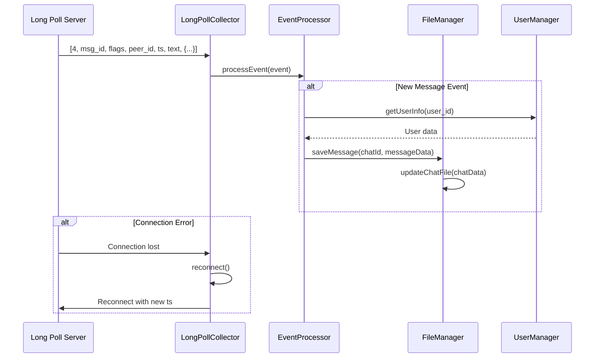
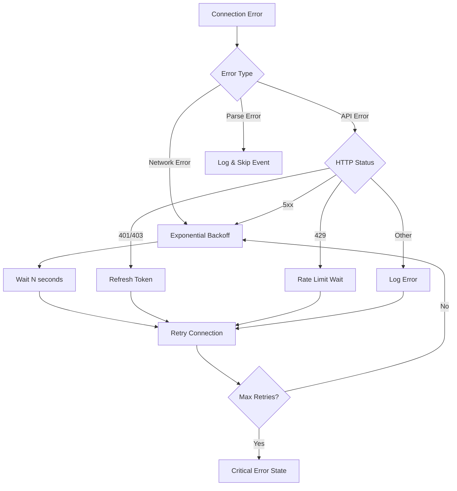

# Design Document

## Overview

VK Message Collector - это система для автоматического сбора и анализа сообщений из чатов ВКонтакте в реальном времени. Система использует VK Long Poll API для мгновенного получения новых событий и сохраняет структурированные данные по чатам в отдельные JSON файлы.

Ключевые принципы:

- **Real-time сбор** через прямое подключение к Long Poll серверу ВК
- **Файловая организация** - один чат = один JSON файл
- **Типобезопасность** через TypeScript интерфейсы
- **Отказоустойчивость** с автоматическим восстановлением соединения
- **Минимальные ресурсы** - оптимизированное использование API запросов

## Architecture

### High-Level Architecture



### Data Flow



## Components and Interfaces

### 1. LongPollCollector

**Ответственность:** Управление подключением к VK Long Poll серверу

```typescript
interface TLongPollCollector {
  start(): Promise<void>;
  stop(): Promise<void>;
  reconnect(): Promise<void>;
  onEvent(callback: EventHandler): void;
}

class LongPollCollector implements TLongPollCollector {
  private serverConfig: LongPollServerConfig;
  private connectionState: ConnectionState;
  private eventHandlers: EventHandler[];

  private async connectToServer(): Promise<void>;
  private async pollEvents(): Promise<LongPollResponse>;
  private handleConnectionError(error: Error): Promise<void>;
}
```

### 2. EventProcessor

**Ответственность:** Обработка и маршрутизация событий от Long Poll

```typescript
interface TEventProcessor {
  processEvent(event: LongPollEvent): Promise<void>;
  registerHandler(eventType: number, handler: EventHandler): void;
}

class EventProcessor implements TEventProcessor {
  private messageParser: MessageParser;
  private userManager: UserManager;
  private chatManager: ChatManager;

  private async handleNewMessage(event: MessageEvent): Promise<void>;
  private async handleMessageFlags(event: FlagsEvent): Promise<void>;
}
```

### 3. ChatManager

**Ответственность:** Управление данными чатов и сохранение в файлы

```typescript
interface TChatManager {
  saveMessage(chatId: number, message: ParsedMessage): Promise<void>;
  getChatData(chatId: number): Promise<TChat | null>;
  updateActiveUsers(chatId: number, userId: number): Promise<void>;
}

class ChatManager implements TChatManager {
  private fileStorage: FileStorage;
  private chatCache: Map<number, TChat>;

  private async loadChatFromFile(chatId: number): Promise<TChat>;
  private async saveChatToFile(chatId: number, chat: TChat): Promise<void>;
  private generateChatFileName(chatId: number, chatTitle?: string): string;
}
```

### 4. UserManager

**Ответственность:** Кеширование и получение информации о пользователях

```typescript
interface TUserManager {
  getUserInfo(userId: number): Promise<TUser>;
  batchGetUsers(userIds: number[]): Promise<Map<number, TUser>>;
  clearCache(): void;
}

class UserManager implements TUserManager {
  private vkApi: VKApi;
  private userCache: Map<number, CachedUser>;
  private pendingRequests: Map<number, Promise<TUser>>;

  private async fetchUsersFromAPI(userIds: number[]): Promise<TUser[]>;
  private isCacheExpired(cacheEntry: CachedUser): boolean;
}
```

### 5. MessageParser

**Ответственность:** Парсинг событий Long Poll в структурированные сообщения

```typescript
interface TMessageParser {
  parseMessageEvent(event: number[]): ParsedMessage;
  parseAttachments(attachmentData: Record<string, any>): TAttachment[];
}

class MessageParser implements TMessageParser {
  private parseEventFlags(flags: number): MessageFlags;
  private extractAttachmentInfo(data: Record<string, any>): TAttachment[];
  private decodeEventText(text: string): string;
}
```

## Data Models

### Core Interfaces

```typescript
interface TUser {
  id: number;
  name: string;
  lastActivity?: Date;
}

interface TChat {
  name: string;
  id: number;
  users: TUser[];
  activeUsers: TUser[];
  messages: TMessage[];
  createdAt: Date;
  updatedAt: Date;
}

interface TMessage {
  id: number;
  author: TUser;
  date: string; // ISO string
  content: string;
  attachments?: TAttachment[];
  flags: MessageFlags;
}

interface TAttachment {
  type: "photo" | "audio" | "video" | "doc" | "sticker" | "link" | "geo";
  id: string;
  url?: string;
  title?: string;
  metadata?: Record<string, any>;
}
```

### Internal Data Models

```typescript
interface TLongPollServerConfig {
  server: string;
  key: string;
  ts: number;
  pts?: number;
}

interface TParsedMessage {
  messageId: number;
  peerId: number;
  fromId: number;
  timestamp: number;
  text: string;
  attachments: TAttachment[];
  flags: MessageFlags;
  conversationMessageId?: number;
}

interface TMessageFlags {
  unread: boolean;
  outbox: boolean;
  replied: boolean;
  important: boolean;
  chat: boolean;
  friends: boolean;
  spam: boolean;
  delUser: boolean;
  fixed: boolean;
  media: boolean;
}

interface TCachedUser extends TUser {
  cachedAt: Date;
  ttl: number;
}
```

### File Storage Format

```typescript
// Формат файла чата: /data/chats/chat-{id}-{sanitized-name}.json
interface TStoredChatData extends TChat {
  version: string; // Версия формата файла
  metadata: {
    fileCreated: Date;
    lastMessageId: number;
    messageCount: number;
    participantCount: number;
  };
}
```

## Error Handling

### Connection Error Strategy



### Error Recovery Mechanisms

1. **Connection Recovery**

   - Автоматическое переподключение с экспоненциальной задержкой
   - Максимум 5 попыток подключения
   - Обновление токена при ошибках авторизации

2. **Data Recovery**

   - Буферизация сообщений при недоступности файловой системы
   - Повторные попытки сохранения с задержкой
   - Резервное сохранение в временные файлы

3. **State Recovery**
   - Сохранение состояния (ts, pts) для восстановления после перезапуска
   - Загрузка пропущенных событий через getLongPollHistory при необходимости

```typescript
interface TErrorRecoveryConfig {
  maxRetries: number;
  baseDelay: number;
  maxDelay: number;
  backoffMultiplier: number;
  bufferSize: number;
  stateSaveInterval: number;
}

class ErrorHandler {
  private async handleConnectionError(error: ConnectionError): Promise<void>;
  private async handleFileSystemError(error: FileSystemError): Promise<void>;
  private async handleAPIError(error: APIError): Promise<void>;

  private calculateBackoffDelay(attempt: number): number;
  private shouldRetry(error: Error): boolean;
}
```

### Logging Strategy

```typescript
interface TLogEntry {
  timestamp: Date;
  level: "info" | "warn" | "error" | "debug";
  component: string;
  message: string;
  metadata?: Record<string, any>;
}

class Logger {
  info(component: string, message: string, metadata?: any): void;
  warn(component: string, message: string, metadata?: any): void;
  error(component: string, message: string, error?: Error): void;
  debug(component: string, message: string, metadata?: any): void;

  private writeToFile(entry: TLogEntry): Promise<void>;
  private rotateLogFiles(): Promise<void>;
}
```

## Testing Strategy

### Unit Testing

1. **Component Tests**

   - MessageParser: тестирование парсинга различных типов событий
   - UserManager: мокирование VK API и тестирование кеширования
   - ChatManager: тестирование файловых операций с временными файлами
   - ErrorHandler: тестирование логики повторных попыток

2. **Integration Tests**
   - EventProcessor: интеграция парсера, пользователей и чатов
   - LongPollCollector: мокирование Long Poll ответов
   - FileStorage: работа с реальной файловой системой

### Testing Tools

```typescript
// Мокирование VK API ответов
interface TMockLongPollResponse {
  ts: number;
  updates: number[][];
  failed?: number;
}

class VKApiMock {
  mockLongPollServer(config: Partial<TLongPollServerConfig>): void;
  mockUsersGet(users: TUser[]): void;
  mockConversationsGet(chats: any[]): void;
}

// Утилиты для тестирования файлов
class FileTestUtils {
  createTempChatFile(chatData: TChat): string;
  cleanupTempFiles(): void;
  assertFileContent(filePath: string, expectedData: any): void;
}
```

### E2E Testing Scenarios

1. **Полный цикл сбора сообщений**

   - Подключение к Long Poll → Получение событий → Сохранение в файлы

2. **Recovery тестирование**

   - Имитация обрыва соединения → Проверка переподключения
   - Недоступность файловой системы → Буферизация → Восстановление

3. **Performance тестирование**
   - Обработка большого количества событий
   - Нагрузочное тестирование файловых операций
   - Memory leak тестирование при длительной работе

### Test Data

```typescript
const TEST_EVENTS = {
  NEW_MESSAGE: [
    4,
    123456,
    49,
    2000000001,
    1755105000,
    "Тестовое сообщение",
    { from: "123" },
  ],
  MESSAGE_READ: [7, 123456, 1, 2000000001],
  USER_ONLINE: [8, 456789, 1, 0],
  MESSAGE_WITH_ATTACHMENTS: [
    4,
    123457,
    561,
    123456,
    1755105001,
    "Фото",
    {},
    { attach1_type: "photo", attach1: "123_456" },
  ],
};

const TEST_USERS: TUser[] = [
  { id: 123, name: "Тестовый Пользователь 1" },
  { id: 456, name: "Тестовый Пользователь 2" },
];
```

Система спроектирована для надежного сбора сообщений в реальном времени с упором на отказоустойчивость, производительность и простоту сопровождения.
